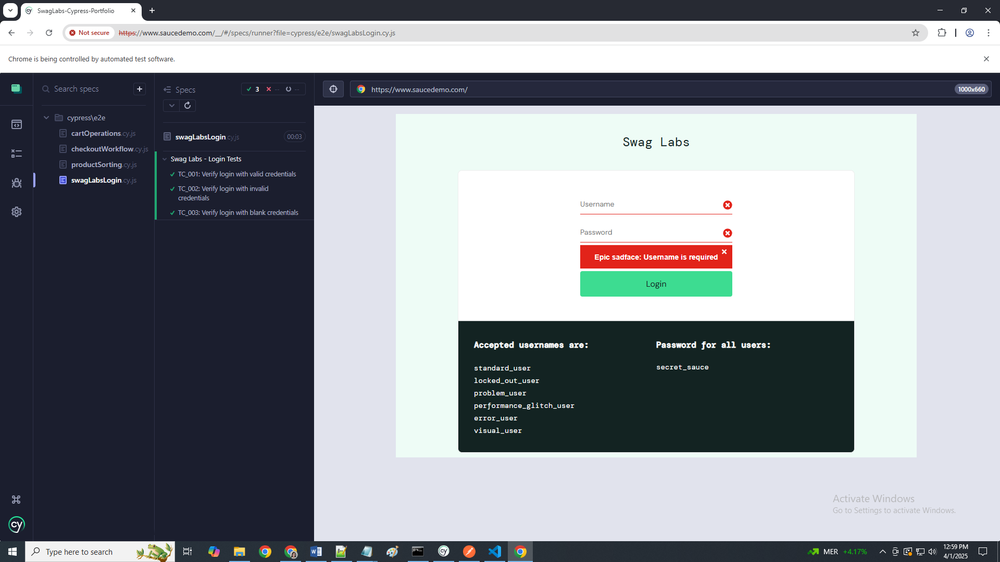
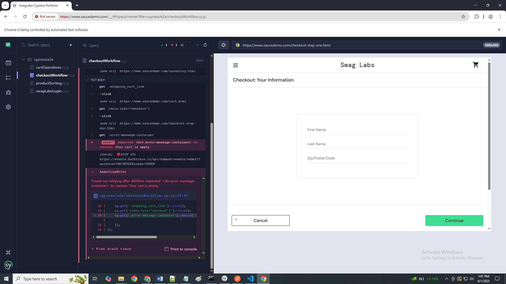

# Swag Labs Cypress Portfolio

## 📜 Project Overview
This project is a comprehensive **Cypress portfolio** demonstrating functional and edge-case testing workflows for the Swag Labs e-commerce platform. The tests cover key features such as login, product sorting, cart operations, and the checkout workflow. The purpose of this portfolio is to showcase robust **manual-to-automated testing practices** using Cypress.

---

## 📁 Folder Structure

The project is organized into the following structure:

```plaintext
SwagLabs-Cypress-Portfolio/
├── cypress/
│   ├── e2e/
│   │   ├── swagLabsLogin.cy.js        # Tests login functionality
│   │   ├── productSorting.cy.js       # Validates product sorting options
│   │   ├── cartOperations.cy.js       # Covers cart features like add/remove
│   │   ├── checkoutWorkflow.cy.js     # Verifies checkout workflows
├── screenshots/                       # Test result snapshots
│       ├── swagLabsLogin.png
│       ├── productSorting.png
│       ├── cartOperations.png
│       ├── checkoutWorkflow.png
├── documentation/
│   ├── README.md                      # Repository overview and setup instructions
│   ├── manualTestCases.md             # Detailed manual test cases
```

---

## 🧪 Tests and Features

| **Test Case ID** | **Scenario**                             | **Expected Outcome**                               | **Status**   |
|------------------|------------------------------------------|---------------------------------------------------|--------------|
| TC_001           | Login with valid credentials            | Redirected to inventory page                     | ✅ Pass      |
| TC_002           | Login with invalid credentials          | Error message displayed                          | ✅ Pass      |
| TC_004           | Sorting by price (Low to High)          | Items sorted correctly                           | ✅ Pass      |
| TC_012           | Checkout with empty cart                | Error: "Your cart is empty."                     | ❌ Fail      |

For a complete list of test cases, refer to the `manualTestCases.md` file in the documentation folder.

---

## 🚀 Getting Started

### **Prerequisites**
Before running the tests, ensure you have the following installed:
- **Node.js** (v16 or later)
- Cypress (installed globally or locally)

### **Clone Repository**
1. Clone the repository to your local machine:
   ```bash
   git clone https://github.com/EllynMaeJuarez/SwagLabs-Cypress-Portfolio.git
   ```

2. Navigate to the project directory:
   ```bash
   cd SwagLabs-Cypress-Portfolio
   ```

### **Install Dependencies**
Run the following command to install dependencies:
```bash
npm install
```

### **Run Cypress Tests**
1. Open Cypress in interactive mode:
   ```bash
   npx cypress open
   ```
2. Select any test script in the `e2e/` folder (e.g., `swagLabsLogin.cy.js`) to run it.

Alternatively, run all tests in headless mode:
```bash
npx cypress run
```

---

## 📸 Screenshots

Below are example screenshots captured during test execution:

**Login Test (Passed):**  


**Empty Cart Checkout Test (Failed):**  


Screenshots of passed and failed tests are stored in the `cypress/screenshots/` directory.

---

## 🛠 Tools & Technologies
- **Test Framework:** Cypress
- **Languages:** JavaScript
- **Browsers:** Chrome, Microsoft Edge
- **Version Control:** Git and GitHub

---

## 📄 Test Results Summary
The overall results of the test cases are detailed in the `manualTestCases.md` file, which provides the pass/fail status and notes on any observed bugs (e.g., empty cart checkout validation).

---

## 🙋‍♀️ Contributor
**Ellyn Mae Juarez**  
Bachelor of Science in Information Technology, University of Cebu  
- **Aspiring QA Engineer**
- LinkedIn: [Ellyn Mae Juarez](https://www.linkedin.com/in/ellyn-mae-juarez/)
